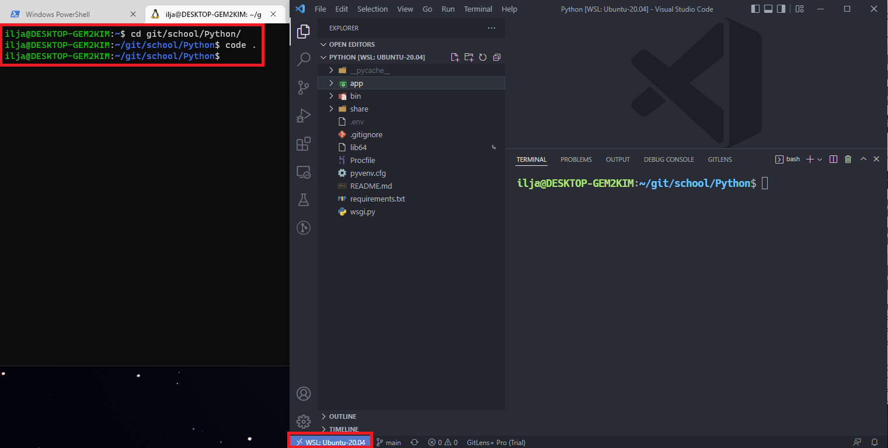

# Python as a web service backend

[**Table of Contents**](#table-of-contents)

This report is based on my experience with Python as a backend language for our 'Ohjelmistoprojekti 2' - Course.
Our main goals for the project were:

- Learn about web scraping.
- Make a working fullstack project with Frontend, Backend and DB.

## Our Stack

- React, Material UI.
- Python, Flask, PyMongo, BeautifulSoup.
- MongoDB, Heroku.

React was a pretty obvious choice for the projects frontend, we went with Material UI as the component library of choice. 
Python was chosen as a backend mainly for two reasons: 1. To learn python, and 2. It had some well documented web scraping libraries.  
MongoDB was our database of choice for this project. We paired it with Heroku for hosting and PyMongo on the backend side for queries.  
For our web-app framework we went with Flask paired with PyMongo for a fairly simple and streamlined solution.

## Why Python?

- Ease of use
  - Python has a very simple syntax
  - Very fast to set up and start coding.
- Good tooling for our purposes.
  - Our main criteria for the language was the ability to scrape websites and Python was a strong candidate.
- **Learning!**
  - Python was pretty new to the whole team.
  - Most importanly we wanted to learn something a bit different this time around.

---

## Setting up Linux

For my development environment I went with Linux, and more specifically WSL2. It is possible to develop Python on Windows, but I saw the unix environment to be more user friendly and better suited for Python development, especially since Ubuntu comes preconfigured with APT package management tool.
I saw WSL as the no-brainer choice, since virtual machines require a lot more initial setup than WSL.  
`wsl --install`  
_Running this command in PowerShell admin mode installs WSL2 and Ubuntu Distro for you. So simple!_  
Also VSCode has extensions that make WSL development very easy!

_(click the arrow/text below for images)_

  
VSCode WSL Extension

  
Launching VSCode in Linux Environment

 

**NOTE!**

This was my first time working with WSL and Linux in general. I made the mistake of not creating a user, and instead used root. Only later I realized that it is better to use a user with Sudo privilages instead. I reinstalled my Linux environment because I had messed up a bunch of installations (multiple Python3's) and privilages (root, instead of user) and couldn't get some libraries to work reliably.

## Python dependency management and Venv

After working on our project we quickly realized that there is no dependency management in Python by itself.
The simple way to do it is use `pip freeze > requirements.txt`, this command tells pip to output _ALL_ dependencies to a text document called requirements.txt (_overwrite/create one if it doesn't exist_). Then, when you or a colleague need to install the dependencies, use the command `pip install -r requirements.txt`. this tells pip to install dependencies recursively from the file requirements.txt. It is all very simple!  

**HOWEVER**
what happens if your colleague has a different python version, or slightly older dependencies? This means that everytime someone runs `pip freeze > requirements.txt` that persons versions and dependencies get outputted to the .txt file.
 
 

Thankfully someone else has also thought about this, and that is why libraries like [Venv](https://docs.python.org/3/library/venv.html) exists! 
Venv is a library for Python that allows you to make your own virtual environments inside specific directories. By making a clean virtual environment in a directory, Venv allows you isolate the specific Python version and dependencies you need for the project. All you need to do is activate the environment and you switch to using the locally installed packages and python interpreter, instead of the global ones.
This allows developers to switch easily between multiple projects and their own global packages without messing up the dependencies.

  
Example of how Venv changes to use local packages instead of global.

   

- Notice how after `source bin/activate` (_used to activate the virtual env_) the Unix command `which` (_Used to find the location of executables_) points to a different folder.
   
   
  

  
Example of dependencies with/without Venv.

   

- command `deactivate` is used to exit the virtual env.
 
 

 

Setup is fairly simple, download the Venv package globally and install using command `Venv <directory>`, this creates a new virtual environment at `<directory>`.  
You can now start working on your new project!  
For an existing project (like in our case), you want to `Venv <existing project directory>`, then write down all the dependencies used on your project. `source bin/activate`, and install the dependencies, either through `pip install -r requirements.txt`, or one by one.

## Flask web-app framework

Main contenders for the wep-app framework were Flask and Django. Our team went with Flask for it's very simplicity. Django is better for a fully-fledged production application, but since our application was only ever going to be released in heroku and github we were content with using Flask.

Flask uses WSGI for Framework-HTTP Server communications and Gunicorn as a lightweight HTTP Server.

**Setting up Flask**

Setup for Flask is fairly simple, install flask through pip: `pip install Flask` (dont forget to turn on your virtual environment). Then we import the Flask class into our project, and create an instance of the class.

  
Flask setup

  

 
Now that Flask is setup we can use app instance of the Flask class to create routes for our web-app.

 

  
Flask route setup

  

 
This is all there is to setting up flask. Overall it's a really simple process. Flask documentation for how to setup routing and routes is really good and simple.
We didn't use Flask for rendering any backend templates, only for routing.
 
 

  
Our project's Flask usage as a REST API

  

 

As you can see in the picture we used Flask for a REST API. In this example we had a route that interfaced with MongoDB through PyMongo, using `request.method` to get the method used by the frontend. and the route `api/searches/<id>` for querying specific id's from MongoDB.

## Python and MongoDB

Our database of choice was MongoDB. For interfacing with the database itself we used a library called PyMongo, an official library from MongoDB. We also used a library called Flask-PyMongo, a wrapper for PyMongo that integrates with Flask.
Setup itself relatively simple. Install the Flask-Pymongo package (which also installs the PyMongo package).

 

  
PyMongo setup

  

 

We get the MongoDB connection key from a .env file using the dotenv library.
then load the key into flask's config files. start the mongoDB client with `mongo = PyMongo(app)` define our database as the variable `db` (_syntax to get the db from client is clientName.DBName, in our case mongo.db_)

After this we interface with the database progammatically by using the queries defined in PyMongo documentation. You access specific collection through the client class: client.database.collection. In our case we set up the `db` variable as the database, and the collection we want to access is searches. We access it simply by calling `db.searches`.

In the picture with the REST example, you can see the implementation of queries on the specific `searches` collection.

  
Our project's Flask usage as a REST API

  

## Getting everything up and running in Heroku

Our hosting platform for this project was Heroku, it's free and easy to use.
We did not host the db on Heroku, instead MongoDB has their own cloud solution called Atlas.
the Flask app that is hosted on Heroku is connected to the MongoDB Atlas instance through Heroku env variables.

  
Env variables example

  Remember the MONGO_KEY env variable in PyMongo setup? this is the same one.
  

 

Deployment happens automatically through GitHub pushes. Once a new PR is pushed onto our main branch, the branch gets pushed to heroku's hosting and deployed!

---

# Conclusions

I found Python an interesting language to work with. It has a simple syntax and it's own thing with indentations and some funny data structures (dict and list). But it's really fast to pick up, and I can see it working as a first coding language. Also for a quick and rough prototype project it is really nice, especially with really good library coverage. My biggest problem was the initial setup of the development environment.

## The good

- Python's syntax is really simple and clean.
- The libraries we used were easy to use and well documented.
- Really fast setup for a hobby project with Flask and PyMongo.
- Python is really satisfying to use on a Unix/unix-like system.

## The bad

- Package management is not so simple with pip.
- Indentation to define code blocks might feel weird to someone used to curly brackets.

## The ugly

- As a first time Python user, the package management is not at all intuitive and took some time to figure out Venv and pip.

# Sources

- [BeautifulSoup Documentation](https://www.crummy.com/software/BeautifulSoup/bs4/doc/)
- [Flask Documentation](https://flask.palletsprojects.com/en/2.1.x/)
- [PyMongo Documentation](https://pymongo.readthedocs.io/en/stable/)
- [Python web scraping tutorial with BeautifulSoup](https://realpython.com/beautiful-soup-web-scraper-python/)
- [Venv documentation](https://docs.python.org/3/library/venv.html)

# Table of Contents

- **Python as a web service backend**
  - [Our Stack](#our-stack)
  - [Why Python?](#why-python)
  - [Setting up Linux](#setting-up-linux)
  - [Python dependency management and Venv](#python-dependency-management-and-venv)
  - [Flask web-app framework](#flask-web-app-framework)
  - [Python and MongoDB](#python-and-mongodb)
  - [Getting everything up and running in Heroku](#getting-everything-up-and-running-in-heroku)
- **Conclusions**
  - [The good](#the-good)
  - [The bad](#the-bad)
  - [The ugly](#the-ugly)
- [Sources](#sources)
